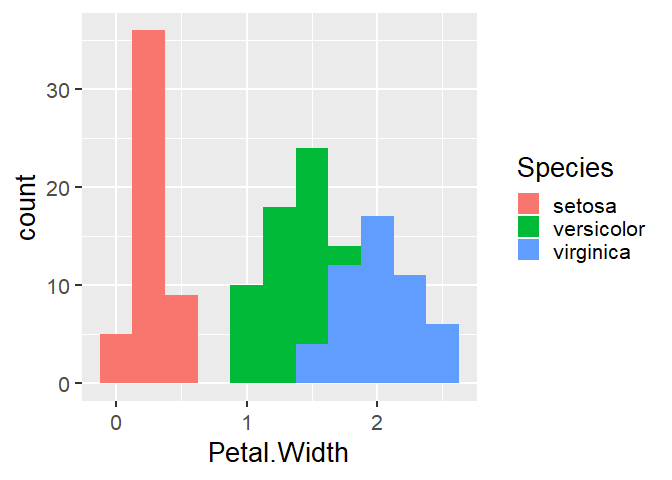

<!-- README.md is generated from README.Rmd. Please edit that file -->

[](http://www.repostatus.org/#wip)

# drakepkg

**Cascadia R Conference 2019 Update:** the slides from Tiernan Martin’s
talk can be downloaded here:
[drakepkg-slides-cascadiarconf2019.pdf](https://github.com/tiernanmartin/drakepkg/raw/master/drakepkg-slides-cascadiarconf2019.pdf)

<hr>

The goal of [`drakepkg`](https://github.com/tiernanmartin/drakepkg) is
to demonstrate how a [`drake`](https://ropensci.github.io/drake/)
workflow can be organized as an R package.

Why do this? Because the package system in R provides a widely-adopted
method of structuring, documenting, testing, and sharing R code. While
most R packages are general purpose, this approach applies the same
framework to a specific workflow (or set of workflows). It increases the
reproducibility of a complex workflow without requiring users to
recreate the workflow’s environment with a container image (although
that approach is compatible with
[`drakepkg`](https://github.com/tiernanmartin/drakepkg) - see
[januz/drakepkg](https://github.com/januz/drakepkg)).

The [`drakepkg`](https://github.com/tiernanmartin/drakepkg) package is
experimental in nature and currently requires some inconvenient steps
(see the [drake manual - 7.4 Workflows as R
packages](https://books.ropensci.org/drake/projects.html#workflows-as-r-packages));
please use caution when applying this approach to your own work.

## Installation

You can install the released version of
[`drakepkg`](https://github.com/tiernanmartin/drakepkg) from its Github
[repository](https://github.com/tiernanmartin/drakepkg) with:

``` r
devtools::install_github("tiernanmartin/drakepkg")
```

## Usage

The following table shows how each feature of a
[`drake`](https://ropensci.github.io/drake/) workflow is made accessible
within an R
package:

| `drake`                   | R Package                                                                                                     |
| :------------------------ | :------------------------------------------------------------------------------------------------------------ |
| plans, commands           | functions (`R/*.R`)                                                                                           |
| targets                   | stored in the cache (`.drake/`)                                                                               |
| input files, output files | internal data (`inst/intdata/*`), external data (`inst/extdata/*`), images and documents (`inst/documents/*`) |

The package comes with two example
[`drake`](https://ropensci.github.io/drake/) plans, both of which are
loosely based on the `main` example included in the
[`drake`](https://ropensci.github.io/drake/) package:

1.  An introductory plan: `drakepkg::get_example_plan_simple()`
2.  A plan that involves downloading external data:
    `drakepkg::get_example_plan_external()`

The first plan looks like this:

``` r
library(drake)
get_example_plan_simple()
#> # A tibble: 5 x 2
#>   target     command                                                       
#>   <chr>      <expr>                                                        
#> 1 raw_data   readxl::read_excel(file_in("intdata/iris-internal.xlsx"))    ~
#> 2 ready_data dplyr::mutate(raw_data, Species = forcats::fct_inorder(Specie~
#> 3 hist       create_plot(ready_data)                                      ~
#> 4 fit        lm(Sepal.Width ~ Petal.Width + Species, ready_data)          ~
#> 5 report     write_html_report(hist, fit, knitr_in("documents/report-simpl~
```

Several commands used in the plan (e.g,`create_plot()`,
`write_report_simple()`) are included as part of the
[`drakepkg`](https://github.com/tiernanmartin/drakepkg) R package and so
is the plan itself; the documentation for each of these functions can be
accessed using R’s `help()` function (for example,
`help(get_example_plan_simple)`).

Once you have installed and loaded
[`drakepkg`](https://github.com/tiernanmartin/drakepkg), you can
reproduce the introductory plan’s workflow by performing the following
steps:

1.  Copy the package’s directories and source code files into your
    working directory with the `copy_drakepkg_files()` function
2.  View the plan (`get_example_plan_simple()`) and then make it
    (`make(get_example_plan_simple())`)
3.  Access the plan’s targets using `drake` functions like `readd()` or
    `loadd()`
4.  View the html documents created by the workflow in the `documents/`
    directory

<!-- end list -->

``` r
# Step 1: copy the source code files into the working directory

copy_drakepkg_files()
```

``` r
# Step 2A: view the example plan

get_example_plan_simple()
#> # A tibble: 5 x 2
#>   target     command                                                       
#>   <chr>      <expr>                                                        
#> 1 raw_data   readxl::read_excel(file_in("intdata/iris-internal.xlsx"))    ~
#> 2 ready_data dplyr::mutate(raw_data, Species = forcats::fct_inorder(Specie~
#> 3 hist       create_plot(ready_data)                                      ~
#> 4 fit        lm(Sepal.Width ~ Petal.Width + Species, ready_data)          ~
#> 5 report     write_html_report(hist, fit, knitr_in("documents/report-simpl~
```

``` r
# Step 2B: make the example plan

make(get_example_plan_simple())
#> All targets are already up to date.
```

``` r
# Step 3: examine the plan's targets

readd(fit)
#> 
#> Call:
#> lm(formula = Sepal.Width ~ Petal.Width + Species, data = ready_data)
#> 
#> Coefficients:
#>       (Intercept)        Petal.Width  Speciesversicolor  
#>             3.236              0.781             -1.501  
#>  Speciesvirginica  
#>            -1.844

readd(hist)
```



This example and others are available in the package vignette
(`vignette('drakepkg')`).
